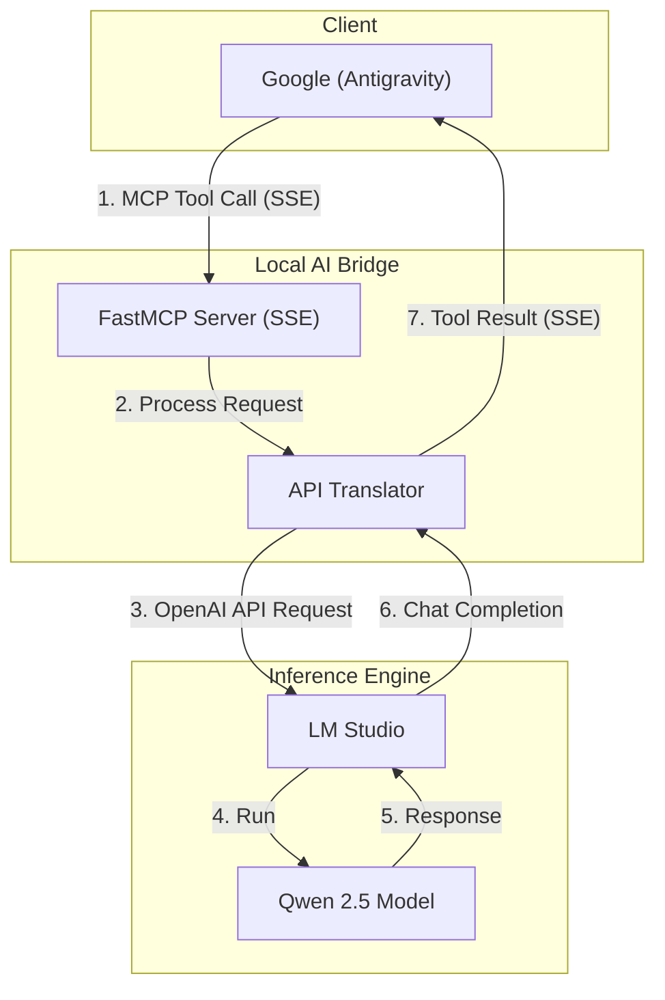
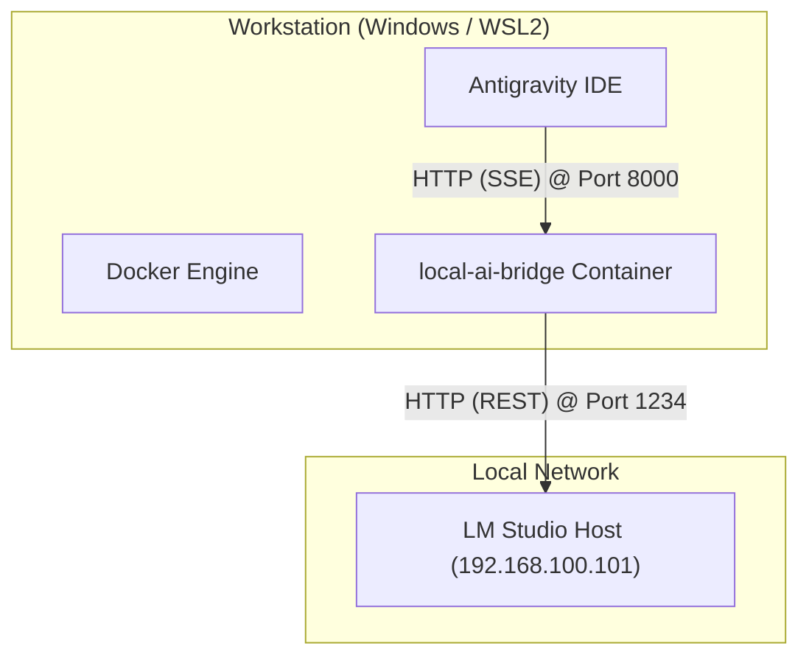

# 🌉 Local AI Bridge

> **"Bridging the brain of Qwen 2.5 to the elegance of Google Antigravity."**

Welcome to **Local AI Bridge**, a lightweight, containerized MCP (Model Context Protocol) gateway. This project allows the **Google Antigravity IDE** to communicate seamlessly with a local **Qwen 2.5** instance running on **LM Studio**.

Designed with Swiss-engineered precision 🇨🇭 for an Enterprise Architect's workflow, this bridge keeps your data local, your latency low, and your AI stack fully automated.

---

## 🚀 The Mission

Google Antigravity is a brilliant agentic IDE, but sometimes the task requires the specific touch of a local powerhouse like **Qwen 2.5**. This bridge translates MCP tool calls into OpenAI-compatible API requests for LM Studio, wrapped in a production-ready Docker vessel.

### 🛠 Tech Stack

- **The Brain:** Qwen 2.5 (via [LM Studio](https://lmstudio.ai/))
- **The Transport:** [FastMCP](https://github.com/modelcontextprotocol/python-sdk) (Python/SSE)
- **The Vessel:** Docker (hosted on `fredlamenace/local-ai-bridge`)
- **The Pipeline:** GitHub Actions with Dev/QA/Main environment isolation.

---

## 🏗 Architecture (The "EA" View)

### 1. Logical Architecture

### 2. Physical Architecture
